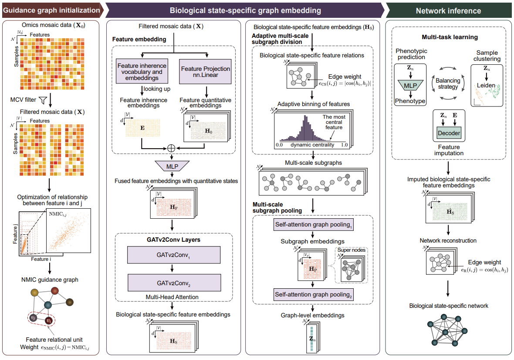

<div align="center">

# DeepTAN

[](https://pypi.org/project/deeptan-network/)
[](https://pypi.org/project/deeptan-network/)

</div>

## Describe

DeepTAN is a graph-based multi-task framework designed to infer large-scale multi-omics trait-associated networks (TANs) and reconstruct phenotype-specific omics states.

<p align="center">
  
</p>

**Figure 1. Overview of the DeepTAN framework.**  
DeepTAN is a graph-based framework that learns gene representations and reconstructs trait-aware gene networks from omics data. Input features are filtered and projected to generate a guidance graph and quantitative embeddings. Stacked GATv2Conv layers refine embeddings via multi-head attention, producing biological
state–specific representations. An adaptive multi-scale subgraph pooling strategy captures hierarchical network structure by aggregating local subgraphs into global graph embeddings. The learned representations are jointly optimized for phenotype prediction, sample clustering, and feature imputation through a multi-task
learning with dynamic balancing strategy. DeepTAN generates biological-specific gene interactions in which edge weights quantitatively reflect interaction strength, enabling downstream trait-aware network inference.

## Installation

```bash
conda create -n deeptan python=3.13 -y
conda activate deeptan

pip install torch==2.7.0 torchvision==0.22.0 torchaudio==2.7.0 --index-url https://download.pytorch.org/whl/cu128
pip install torch_geometric
pip install pyg_lib torch_scatter torch_sparse torch_cluster torch_spline_conv -f https://data.pyg.org/whl/torch-2.7.0+cu128.html
pip install deeptan-network
```

## Usage

### 1. Build guide graphs with [mi2graph](./mi2graph/)

Before training DeepTAN, you first need to construct guide graphs from expression data. 

This step is performed using [mi2graph](./mi2graph/).

### 2. Convert graph data to litdata format
After building guide graphs with `mi2graph`, the next step is to optimize the dataset into **litdata** format for faster training and evaluation.

We provide a data optimization script:

- [x] run_04_litdata.py

#### Why use litdata format?

DeepTAN trains on graph-structured gene expression data. Directly reading raw `.parquet` and `.npz` files during every training epoch can be inefficient, especially when the dataset is large or when multiple random splits are used.

The litdata format is used to pre-process and serialize graph samples into optimized chunks. It helps to:

  - speed up data loading;
  - reduce repeated parsing of raw files;
  - support efficient multi-worker dataloading;
  - keep train/validation/test data in a consistent format;
  - save metadata required for later model initialization.

#### 2.1 What `run_04_litdata.py` does

`run_04_litdata.py` converts the guide graph and expression datasets into optimized `litdata` format for DeepTAN training, validation, and testing.

Specifically, the script performs the following steps:

- reads the training guide graph from a `.npz` file generated by `mi2graph`;
- reads the validation and test datasets from `.parquet` files;
- constructs a `DeepTANDataModule`;
- exports the train/validation/test splits into optimized `litdata` chunks;
- saves metadata required for later model initialization.

If a label file is provided, it is also copied into the output directory.

#### 2.2 `run_04_litdata.py` arguments

The main arguments of `run_04_litdata.py` are summarized below.

##### Required arguments

| Argument | Description |
|---|---|
| `--trn_npz` | Path to the training graph data in `.npz` format generated by `mi2graph`. |
| `--val_parquet` | Path to the validation data in `.parquet` format. |
| `--tst_parquet` | Path to the test data in `.parquet` format. |

##### Optional arguments

| Argument | Description |
|---|---|
| `--labels` | Path to label data in `.parquet` format. |
| `--output_dir` | Output directory for optimized `litdata` files and metadata. |
| `--bs` | Batch size used when constructing the data module. |
| `--thre_mi` | Threshold for graph edge attributes. |
| `--in_feat` | Optional feature list file. If not specified, all features are used. |
| `--in_obs` | Optional training observation filter file. If provided, only training cells whose `obs_names` are present in this file will be retained. |
| `--onlytest` | If enabled, only the test split is optimized. |
| `--n_workers` | Number of workers used during `litdata` optimization. |

The --labels file should be provided in .parquet format and should match the samples in the expression data.

  - For multi-class label prediction, the labels should be encoded in one-hot format.
  - For phenotype regression, the labels should contain continuous numerical phenotype values. We recommend applying log1p transformation before generating the label file, especially when the phenotype distribution is highly skewed.

#### 2.3 How `--in_obs` works

The `--in_obs` argument filters training observations before generating `litdata`.

When `--in_obs` is provided, the script:

1. reads all `obs_names` from the training `.npz` file;
2. reads target `obs_names` from the provided `.parquet` file;
3. computes the intersection between the two sets of `obs_names`;
4. keeps only the matched training indices when generating `litdata`.

This is useful when you want to:

- use precomputed global graph files;
- restrict training to a subset of cells or samples;
- run split-based or seed-based experiments while reusing the same graph.


#### 2.4 Example shell script

You can run the conversion directly with `run_04_litdata.py`:

```bash
python run_04_litdata.py \
  --trn_npz /path/to/your_train_guide_graph.npz \
  --val_parquet /path/to/your_validation_expression.parquet \
  --tst_parquet /path/to/your_test_expression.parquet \
  --labels /path/to/your_label.parquet \
  --in_obs /path/to/your_train_guide_graph.parquet \
  --output_dir /path/to/your_output_dir \
  --n_workers 10
```

Alternatively, you can use the provided shell wrapper:
```bash
bash ./examples/run04.local_litdata_optimize.sh
```

Please note that these wrapper scripts are provided as templates. Before running them, you need to update the paths and settings inside each script according to your own project structure.

#### 2.5 Output structure
A typical output directory looks like:

```bash
/path/to/your_output_dir/
  ├── train/
  ├── val/
  ├── test/
  ├── litdata_others2save.json
  ├── litdata_others2save.pkl
  └── label_class_onehot.parquet
```
Where:

- train/, val/, test/ are litdata-optimized datasets,
- `litdata_others2save.*` store metadata needed later,
- `label_class_onehot.parquet` stores copied label information.


### 3. Train or fine-tune DeepTAN

After preparing the dataset in `litdata` format, you can launch DeepTAN training, fine-tuning, or hyperparameter tuning.

This stage uses:

| Script | Description |
|---|---|
| `run_05_fit_tune.py` | Main training and tuning entrypoint. |
| `run05.local_train.sh` | Example shell wrapper for running training on a prepared split. |

---

#### 3.1 What `run_05_fit_tune.py` does

`run_05_fit_tune.py` is the main fitting and tuning entrypoint.

It supports:

- loading data from a prepared `litdata` directory;
- building the DeepTAN training configuration;
- optionally loading an existing checkpoint;
- selecting the training task focus;
- disabling guide-graph edge weights in GAT layers;
- running either direct training or Optuna-based hyperparameter tuning.

Internally, the script creates a `DeepTANTune` trainer and then calls:

| Condition | Method |
|---|---|
| Auto tuning is enabled | `trainer.optimize(...)` |
| Auto tuning is disabled | `trainer._train_on_args()` |

#### 3.2 `run_05_fit_tune.py` arguments

The main arguments of `run_05_fit_tune.py` are summarized below.

##### Training and tuning mode

| Argument | Alias | Description |
|---|---|---|
| `--auto_tune` | `--atune` | Enable Optuna-based hyperparameter tuning. |

##### Checkpoint and task mode

| Argument | Alias | Description |
|---|---|---|
| `--em` | — | Path to an existing model checkpoint to load. |
| `--focus` | — | Focus on a specific training task. Supported values are listed below. |

Supported values for `--focus`:

| Value | Description |
|---|---|
| `None` | Use the default `multitask` training mode. |
| `recon` | Focus on the reconstruction task. |
| `label` | Focus on the label prediction task. |
| `recon_and_freeze` | Focus on reconstruction while freezing selected modules. |
| `label_and_freeze` | Focus on label prediction while freezing selected modules. |

##### Guide graph option

| Argument | Alias | Description |
|---|---|---|
| `--no_guide_gat` | `--nog` | Disable the use of guide-graph edge weights in graph attention layers. |

##### Data and logging

| Argument | Alias | Description |
|---|---|---|
| `--litdata` | `--data` | Path to the prepared `litdata` directory. |
| `--log_dir` | `--logdir` | Output directory for logs, checkpoints, and training results. |

##### Optimization and model settings

| Argument | Alias | Description |
|---|---|---|
| `--bs` | — | Batch size. |
| `--lr` | — | Learning rate. |
| `--input_node_emb_dim` | `--indim` | Input node embedding dimension. |
| `--is_regression` | `--ir` | Whether the task is treated as regression. |
| `--acc_grad_batch` | `--agb` | Number of gradient accumulation steps. |
| `--chunk_size` | `--ck` | Chunk size used to balance memory usage and computational speed. |

##### Hardware settings

| Argument | Alias | Description |
|---|---|---|
| `--accelerator` | `--ac` | Hardware backend to use, such as `cpu`, `gpu`, `mps`, or `auto`. |
| `--devices` | `--dev` | Devices to use. Can be a single device string or a list-like string, such as `"[0]"`. |

##### Optuna settings

| Argument | Alias | Description |
|---|---|---|
| `--ntrials` | `--nt` | Number of Optuna tuning trials. |
| `--njobs` | `--nj` | Number of parallel Optuna jobs. |

#### 3.3 Example: direct training
Use this when you already know a reasonable configuration and want to train a model directly.

```bash
python run_05_fit_tune.py \
  --data /path/to/your_litdata_dir \
  --logdir /path/to/logs \
  --bs 16 \
  --nt 20 \
  --nj 1 \
  --agb 1 \
  --ck 32 \
  --dev "[0]" \
  --nog 
```

#### 3.4 Example: hyperparameter tuning
To run tuning with Optuna:

```bash
python run_05_fit_tune.py \
  --data /path/to/your_litdata_dir \
  --logdir /path/to/logs \
  --bs 16 \
  --nt 20 \
  --nj 1 \
  --agb 1 \
  --ck 32 \
  --dev "[0]" \
  --nog \
  --atune
```

#### 3.5 Training directory structure
A typical organization is:

```bash
/path/to/logdir/
  └── multitask/
        ├── ...
        ├── checkpoints/
        └── version_0/   
```

The exact internal contents depend on how DeepTANTune and the trainer save checkpoints and logs.

Alternatively, you can use the provided shell wrapper:

```bash
bash ./examples/run05.local_train.sh
```

Please note that these wrapper scripts are provided as templates. Before running them, you need to update the paths and settings inside each script according to your own project structure.

### 4. Model prediction and evaluation

After training or fine-tuning DeepTAN, you can use the trained checkpoint to perform prediction on an optimized `litdata` dataset.

This stage uses:

| Script | Description |
|---|---|
| `run_06_predict.py` | Main prediction entrypoint. |
| `run06.local_predict.py` | Example prediction script with predefined paths. |

The prediction step loads a trained DeepTAN checkpoint, runs inference on a prepared `litdata` split, and saves the predicted reconstruction results for downstream evaluation and analysis.

---

#### 4.1 What `run_06_predict.py` does

`run_06_predict.py` performs model prediction using a trained DeepTAN checkpoint.

Specifically, the script:

- loads an existing model checkpoint, usually `best_model.ckpt`;
- reads an optimized `litdata` directory generated in Step 2;
- runs DeepTAN prediction on the provided dataset;
- saves prediction outputs to `.pkl` and/or `.h5` format;
- skips prediction automatically if the output file already exists, unless `--overwrite` is specified.

#### 4.2 `run_06_predict.py` arguments

The main arguments of `run_06_predict.py` are summarized below.

##### Required arguments

| Argument | Alias | Description |
|---|---|---|
| `--em` | — | Path to an existing trained model checkpoint, for example `best_model.ckpt`. |
| `--litdata` | `--data` | Path to the optimized `litdata` directory used for prediction. |
| `--output` | `--out` | Output path for saving prediction results. If the path does not end with `.pkl`, `.pkl` will be appended automatically. |

##### Optional arguments

| Argument | Alias | Description |
|---|---|---|
| `--maplocation` | `--maploc` | Device mapping used when loading the checkpoint, such as `cpu`, `cuda:0`, or `None`. |
| `--overwrite` | — | Overwrite existing prediction results if the output file already exists. |
| `--getcor` | — | Reserved option for computing feature-label correlations. Currently not enabled in the default prediction workflow. |

By default, `run_06_predict.py` checks whether the output `.pkl` or `.h5` file already exists. If an existing result is found, prediction will be skipped to avoid overwriting previous outputs. Use `--overwrite` to regenerate the prediction results.

#### 4.3 Example: run prediction on a test set

You can run the local prediction script with:

``` bash
python ./examples/run06.local_predict.py
```

Before running it, please modify the following variables according to your own project paths:

```bash
DATA_HOME
dataset
task_name
ckpt_name
batch_size
splits
```

#### 4.4 Output files

A typical prediction output directory looks like:

```bash
/path/to/predict/deeptan/
  └── dataset_name/
        ├── preds+multitask+test.pkl
        └── preds+multitask+test.h5
```
- `.pkl` stores serialized prediction results for Python-based downstream analysis;
- `.h5` stores prediction results in HDF5 format.

#### 4.5 Evaluation

After generating prediction results, you can evaluate model performance by comparing the predicted values with the observed values.

We provide an example evaluation notebook:

```bash
./examples/
└── run07.local.eval.ipynb
```

### 5. End-to-end [examples](./examples/)

If you have not prepared the split files yet, and want to start from raw `h5ad` data, we recommend the following preprocessing steps before Step 1.

#### Prepare labels and split the dataset from raw `h5ad`

##### Label processing

Before building guide graphs, please prepare the label file according to your prediction task:

- **Multi-class label prediction**: convert labels to **one-hot encoding**.
- **Phenotype regression**: use the phenotype values directly, and apply **`log1p` transformation** if needed.

For example, the label preprocessing notebook for one-hot conversion is shown below:

```bash
./examples/
└── run_01_read_celltypes2onehot.ipynb
```

##### Convert `h5ad` to `.parquet` and create train/val/test splits

If your raw data is stored in h5ad format, you can first convert it into `.parquet` format, and then split it into:

- [ ]  training set
- [ ]  validation set
- [ ]  test set

You can also generate multiple random splits for repeated experiments or cross-validation.

The corresponding notebook is:

```bash
./examples/
└── run_02_h5_to_parq_split.ipynb
```

---

Step 1: Build guide graphs
Use mi2graph following:[mi2graph](./mi2graph/)

An example shell script is provided at:

```bash
mi2graph -i /path/to/your_train_expression.parquet \
  -o /path/to/your_guide_graph_output_dir \
  --threcv 6.0 \
  --thremi 0.1 \
  --minwin 0.01 \
  --maxwin 0.3 \
  --stepwin 0.02 \
  --stepsli 0.01 \
  -t 10
```
In general, the `--threcv` parameter controls feature filtering based on coefficient of variation. It affects how many genes/features are retained before mutual information calculation and graph construction.

The `--thremi` has the most direct effect on the density of the generated guide graph. A higher `--thremi` retains fewer but stronger edges, whereas a lower `--thremi` keeps more edges and may increase memory usage in downstream training.

You can run the example script with:

``` bash
bash ./examples/run_03_mi2graph.sh
```

Step 2: Optimize data into litdata

```bash
python run_04_litdata.py \
  --trn_npz /path/to/your_train_guide_graph.npz \
  --val_parquet /path/to/your_validation_expression.parquet \
  --tst_parquet /path/to/your_test_expression.parquet \
  --labels /path/to/your_label.parquet \
  --in_obs /path/to/your_train_guide_graph.parquet \
  --output_dir /path/to/your_output_dir \
  --n_workers 10
```

You can run the example script with:

``` bash
bash ./examples/run04.local_litdata_optimize.sh
```

Step 3: Tune or train DeepTAN

```bash
python run_05_fit_tune.py \
  --data /path/to/your_litdata_dir \
  --logdir /path/to/logs \
  --bs 16 \
  --nt 20 \
  --nj 1 \
  --agb 1 \
  --ck 32 \
  --dev "[0]" \
  --nog \
  --atune
```

Or simply run the shell wrappers:

```bash
bash run.04.local_litdata_optimize.sh
bash run.05.local_train.sh
```

Please note that these wrapper scripts are provided as templates. Before running them, you need to update the paths and settings inside each script according to your own project structure.

Step 4: Model prediction

``` bash
python ./examples/run06.local_predict.py
```

Please note that these wrapper scripts are provided as templates. Before running them, you need to update the paths and settings inside each script according to your own project structure.

### 6. Biological state-specific network construction

DeepTAN can also be used to construct biological state-specific trait-associated networks through a fine-tuning strategy.

In addition to training a general model on large-scale omics data, DeepTAN supports fine-tuning a pretrained model under specific biological contexts, including tissues, cell types, and traits. This fine-tuning strategy allows DeepTAN to capture context-dependent omics patterns and construct tissue-specific networks, cell-type-specific networks, and trait-associated networks.This allows the model to adapt its learned representations to state-specific omics patterns and infer networks that better reflect the association structure under a given biological condition.

For details about the fine-tuning workflow and state-specific network construction, please refer to: [DeepTAN_finetune](./DeepTAN_finetune/)

### 7. Practical notes

#### 7.1 Keep metadata files
Do not remove the generated metadata files:
- [x] `litdata_others2save.json`
- [x] `litdata_others2save.pkl`
They contain structural information required by later stages.

#### 7.2 Label consistency
If you use classification or multitask settings, ensure that the label parquet file is aligned with the cell order and sample naming convention used in the dataset.

#### 7.3 GPU memory tuning
For large datasets, the shell training script shows several useful environment variables for memory optimization, such as:

- [ ] PYTORCH_CUDA_ALLOC_CONF
- [ ] TOTAL_VRAM
- [ ] TORCH_CUDNN_V8_API_ENABLED
- [ ] TORCHINDUCTOR_FREEZING

You may need to adjust:

- [ ] batch size,
- [ ] chunk size,
- [ ] gradient accumulation,
- [ ] number of workers,
depending on your hardware.

### 8. Questions and feedback

If you encounter any problems when using DeepTAN, or if you have questions about installation, data preparation, model training, prediction, or evaluation, please feel free to open an issue in this repository.

📝 When reporting an issue, it would be helpful to include:

- a brief description of the problem;
- the command or script you used;
- the error message or log output, if available;
- your running environment, such as Python version, PyTorch version, CUDA version, and operating system;
- a minimal example or relevant file structure, if possible.

🙌 We welcome bug reports, feature requests, documentation suggestions, and general feedback.

**Thank you for your interest in DeepTAN!** 
